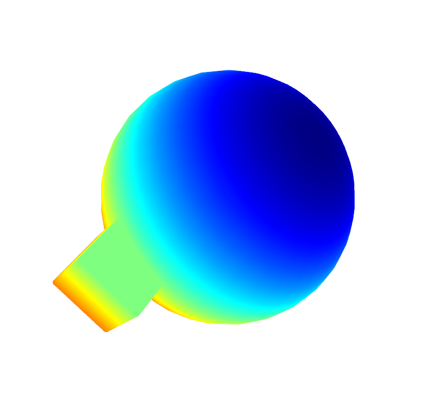
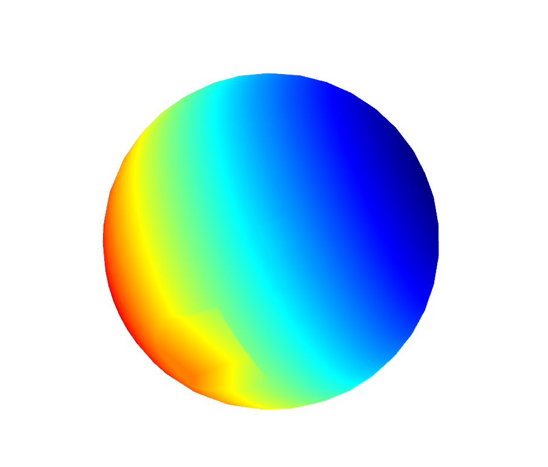
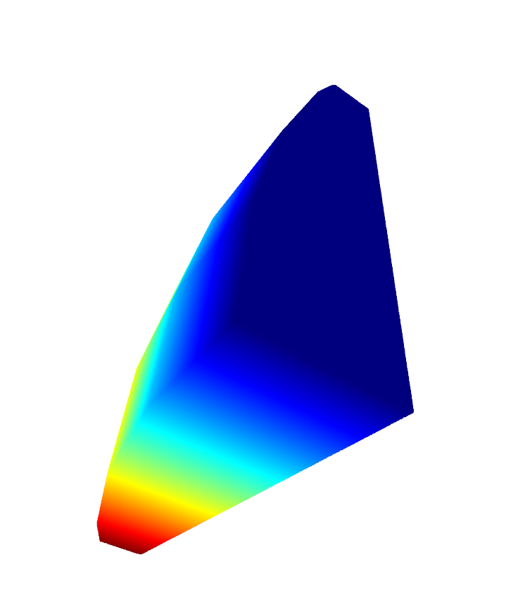
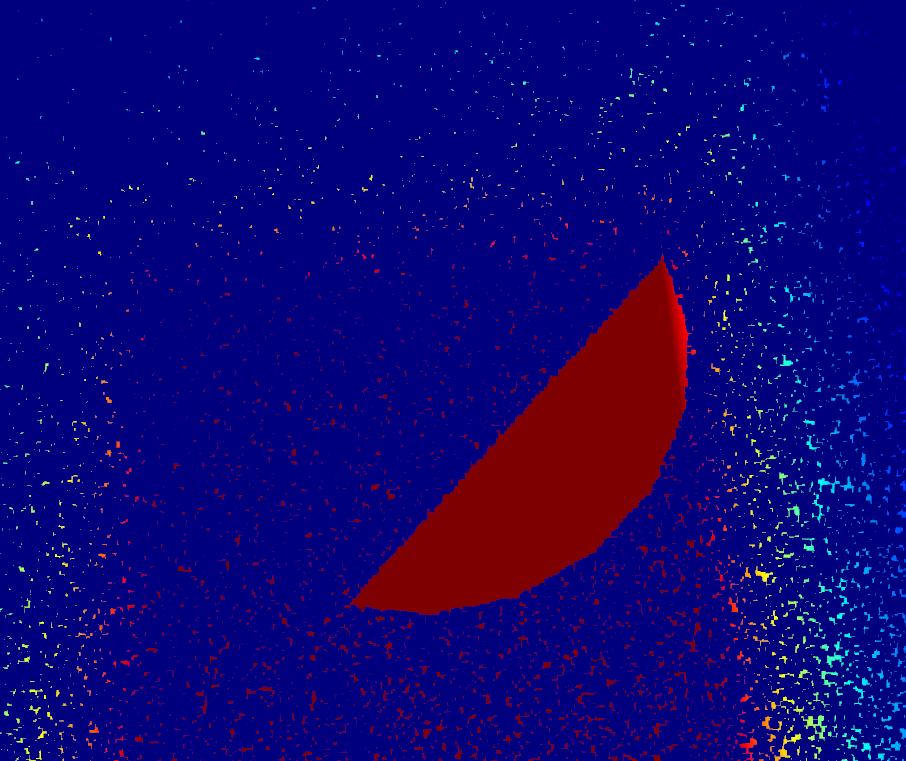
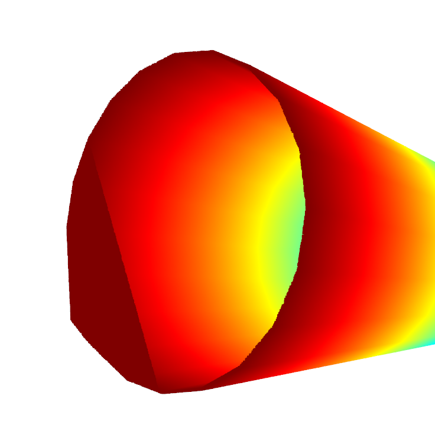

目标指向几何体 布尔运算

阶段计划

- 实现布尔运算
    
    
    
    
    
- 逻辑中优化代码
    
    1 用extend 替代for 循环添加
    
    2 用多层嵌套列表存放数据防止处理过程中多次使用extend
    

- 剔除重复点
    
    使用open3d 本身的轻量化方式去除重复点,只是把轻量化要求提高,以实现三角面大致不变,重复顶点剔除的效果
      
      
- 使用cython 加速
       
    待完成
    在本地中尝试使用cython进行加速,未能成功.等待后续一步一步替换Cython 或者C++ 代码

## 相关错误

1. 共面的diff 和same 区分 
    
    
    
    
    
    从实际的结果看,是部分应该共面的三角形,被判断到了in 中去.
    那么定位的关键点在于,平面的实例方法中，分割三角形逻辑是否完善。
    